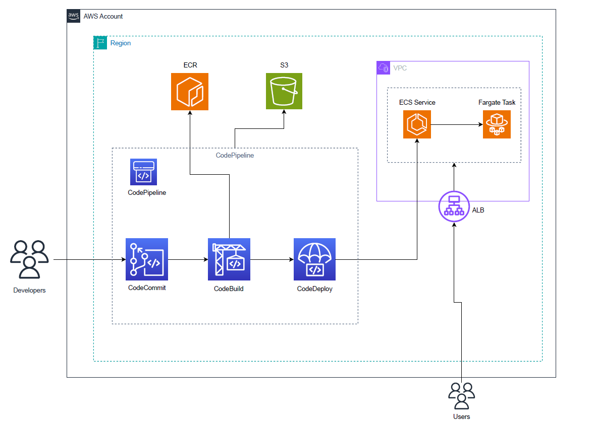

# DevOps CI/CD Deployment Pipeline with AWS and Terraform


This project implements a full deployment devops pipeline on AWS using various services such as CodeCommit, CodeBuild, CodeDeploy, CodePipeline, ECS (Elastic Container Service), ECR, Target Groups, Application Load Balancer (ALB), and ECS Fargate. The pipeline automates the process of deploying code changes to an ECS Fargate cluster with a CI/CD pipeline.

## Overview

The deployment pipeline is comprised of the following stages:

1. **CodeCommit**: Developers push code changes to a CodeCommit repository.

2. **CodeBuild**: CodeBuild automatically pulls the latest changes from the CodeCommit repository, builds a container image, and stores it in Amazon ECR (Elastic Container Registry).

3. **CodePipeline**: CodePipeline orchestrates the workflow, triggering builds on commit and deploying the application.

4. **ECS Cluster Creation**: CodePipeline, through the CodeDeploy stage, deploy the changes to the container running within specified ECS Cluster.

5. **Target Groups and ALB**: Target Groups and an Application Load Balancer are provisioned to manage traffic to the ECS Fargate tasks.


## Setup Instructions

### Prerequisites

1. **AWS Account**: You need an AWS account with appropriate permissions to create and manage resources. Make sure you have configured your AWS credentials locally.

2. **Terraform Installed**: Ensure Terraform is installed on your machine, and you can successfully run Terraform commands.

3. **CodeCommit Credentials**: You'll need IAM user credentials with permissions to push code to CodeCommit repositories. 
   - If you don't have an IAM user, create one. 
   - Access the IAM service console, navigate to "Users," select the desired user, and choose "Security credentials." 
   - Scroll down and click "Generate credentials" under the Git credentials section. 
   - These credentials will be required when you clone the repository from CodeCommit.


### Deployment Steps

1. **Clone the Repository**: Clone this repository to your local machine.

    ```bash
    git clone https://github.com/AbhishekGujjar17/AWS_CICD_PIPELINE.git
    ```

2. Then make sure you are in the `terraform` directory and open the `main.tf` file. Replace the `vpc_id` variable with the ID of your VPC, and then run the following Terraform commands one by one:
   ```terraform
   terraform init
   terraform plan
   terraform apply

3. After you have successfully deployed the module, you may encounter errors in CodePipeline and ECS service when registering targets. Don't worry about these errors; they occur because your code hasn't been deployed yet. 

    - Go to the CodeCommit repository that you just deployed using the module.
    - Clone that repository, make your changes, and push them.
    - This will trigger a successful run of the CodePipeline. CodePipeline runs automatically whenever changes are pushed to the CodeCommit repository, eliminating       the need for manual intervention.

4. Once you've completed step 3 and utilized the code files available in this repository, such as the `index.html`, `Dockerfile`, and `buildspec.yml`, you can access the website by using the DNS of the ALB (Application Load Balancer). The website will appear as follows:

5. If you've created this project solely for learning purposes and wish to avoid any further costs on your AWS account, please execute the following Terraform command to destroy all the resources created using the module:
```terraform
terraform destroy
```


## Notes:
- This project is highly customizable to suit your specific project requirements. For instance, you can easily replace steps within the CodePipeline or integrate GitHub instead of CodeCommit, among other possibilities.

- Currently, the project utilizes public subnets and may grant broader permissions to resources than strictly necessary. Depending on your project's needs or if deploying internally within an organization, consider deploying only to private subnets and tightening permissions accordingly.


## Questions?

For any query email me at agujjar@mun.ca

## License

This project is licensed under the [MIT License](LICENSE).
